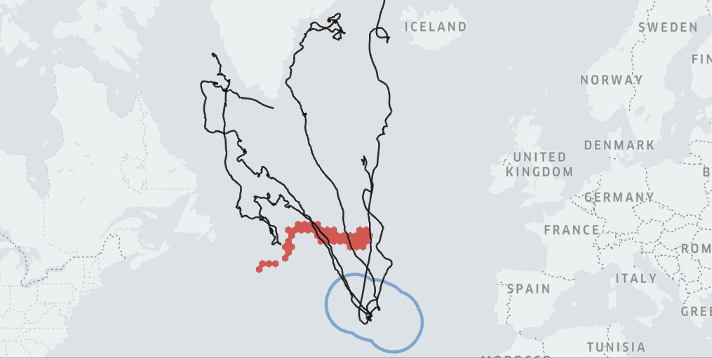
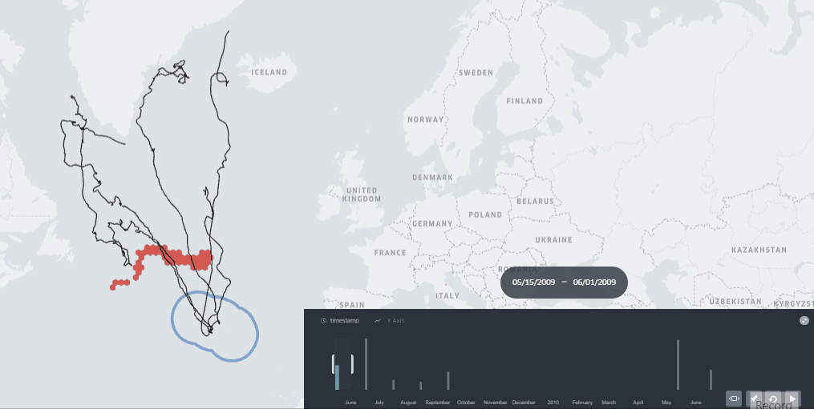
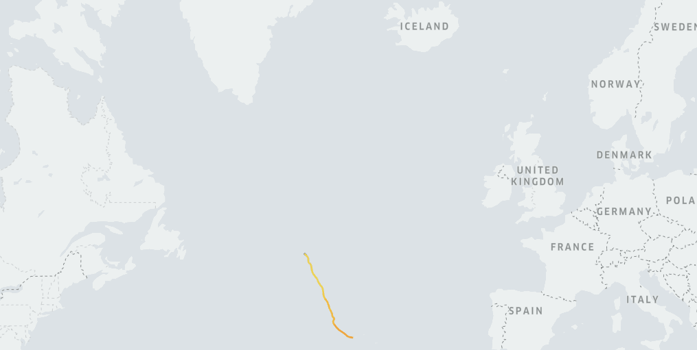
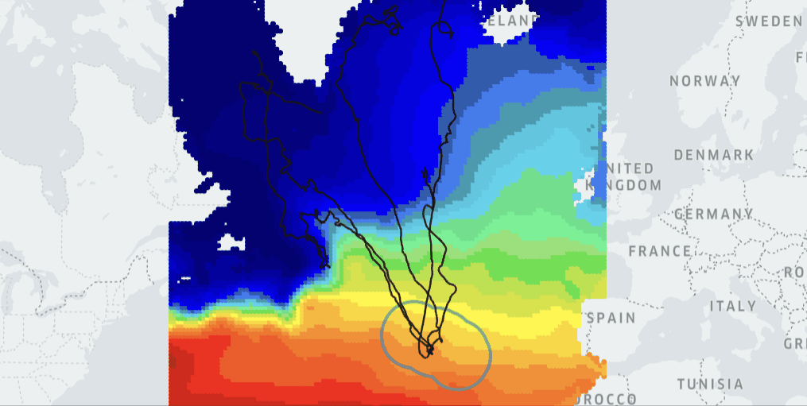
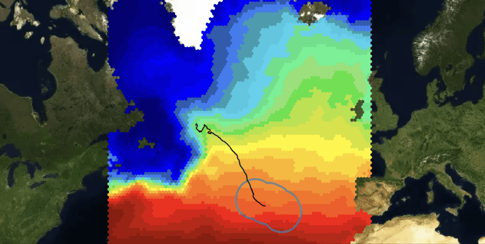

Repo containing the model for ***"Wildlife hostpots and Earth Observation for Marine Spatial Planning"***. EMODnet Hackathon 2023
# Summary
The model uses biologging data of marine migratory species annoted with Sea Surface Temperature, then it generates spatiotemporal behavioral parameters at monthly level that are used to generate probabilistic zones of ocurrence.

These ecological zones are delimited using EMODnet data (CORA - Temperature of Water Columns) and displayed at monthly level to promote Marine Spatial Planning such as conservation efforts and human activity planning. The zones can be added to current Marine Protected Areas by seasons.

# Code
The code for the model of ***Ecological Zones for Marine Spatial Planning with Earth Observation*** will be found in the file `wildtrackereo.py`

The code is used for generating monthly zones to increase conservation efforts and to decrease human impacts in marine migratory species. The model is used in the backend of the real-time deployment with KeplerGl known as **Wildlife Tracker EO**

The code is authored by the team Wildlife Tracker EO and presented in the Hackathon EMODnet 2013.

# Online Demo
[*WILDLIFE TRACKER EO - Click here to open*](https://gis4-wildlife.github.io/WildTrackerEO-EMODnet/root/Wildlife-Tracker-EO-EcoZones.html)

# Other Demos
[*EcoAnnotated biologging data with SST - Click here to open*](https://gis4-wildlife.github.io/WildTrackerEO-EMODnet/root/Azores_Whale_Lab_v0.5.html)

[*Ocean changing ecosystem of SST EMODnet - Click here to open*](https://gis4-wildlife.github.io/WildTrackerEO-EMODnet/root/Wildlife-Tracker-EO-EMODnet.html)

[*EcoGeographical layer with EMODnet SST - Click here to open*](https://gis4-wildlife.github.io/WildTrackerEO-EMODnet/root/Wildlife-Tracker-EO-Biologging.html)

# Contact
[GIS4 Wildlife Movement Analytics](https://www.gis4-wildlife.com/)

# References

### **- Biologging data of Whales in North Atlantic Ocean from the Azores Whale Lab**

The data presented here have been partially used in the following publications: #Silva et al. 2013. North Atlantic blue and fin whales suspend their spring migration to forage in middle latitudes: building up energy reserves for the journey? PLoS ONE 8:e76507.; #Silva et al. 2014. Assessing performance of Bayesian State-Space Models fit to argos satellite telemetry locations processed with Kalman filtering. PLoS ONE 9:e92277.; #Prieto et al. 2014. Sei whale movements and behaviour in the North Atlantic inferred from satellite telemetry. Endangered Species Research 26:103-113.

Licensed under CC-BY-NC. Creative Commons Attribution-NonCommercial.

### **-  Biologging data with Eco-annotation with Earth Observation (sea surface temperature)**

Eco-annotated with Wildlife Tracker v0.5 cortesy of gis4 wildlife movement analytics and dataset from Copernicus Marine Service

### **- MPA assessment area (2020)**

From European Environment Agency. Marine Protected Areas (MPA) assessment areas. From: https://www.eea.europa.eu/data-and-maps/data/marine-protected-areas-mpa-assessment-areas

